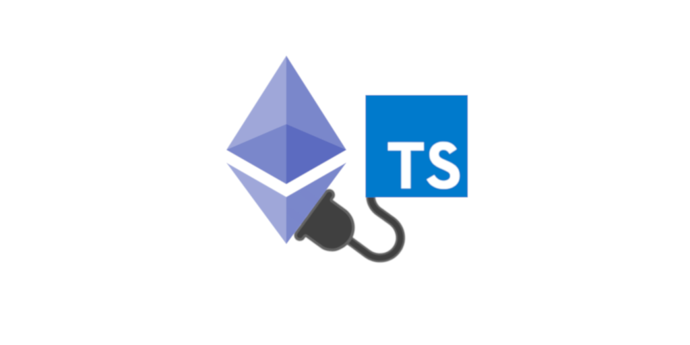

# DAPP Template
You can use this template to build a new project or to practice Katas with smart contracts

This template includes:
* Solc (Solidity Compiler)
* Hardhat (Alternative to Truffle)
* Etherjs (Alternative to Web3.js)
* Typechain (Generates types from ABI of compiled contracts)
* TypeScript
* Jest
* ESLint
* Prettier



## Prerequisites (just for watch mode)
```shell
brew install entr
```

## Scripts

```shell
  npm run accounts
  npm run code:compile
  npm run code:format
  npm run code:lint
  npm run contracts:hint
  npm run contracts:compile
  npm run contracts:watch
  npm run contracts:deploy
  npm run contracts:deploy:goerli
  npm run contracts:verify:goerli
  npm run dependencies:check
  npm run dependencies:update
  npm run network
  npm run test
  npm run test:watch
```


